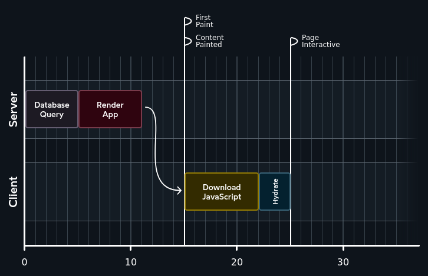

# Server Component


## Server Side Rendering (SSR)


most React setups used a "client-side" rendering strategy.

The user would receive an HTML file that looked like this:
```html
<!DOCTYPE html>
<html>
    <body>
        <div id="root"></div>
        <script src="/static/js/bundle.js"></script>
    </body>
</html>
```


### Bouncing back and forth


*network request graph of a Client Side Rendering (CSR)*


*network request graph of a Server Side Rendering (SSR)*


## Some Definitions
* **First Paint**:
The user is no longer staring at a blank white screen. The general layout has been rendered, but the content is still missing. This is sometimes called FCP (First Contentful Paint).

* **Page Interactive**:
React has been downloaded, and our application has been rendered/hydrated. Interactive elements are now fully responsive. This is sometimes called TTI (Time To Interactive).

* **Content Paint**:
The page now includes the stuff the user cares about. We've pulled the data from the database and rendered it in the UI. This is sometimes called LCP (Largest Contentful Paint).


Instead of requiring a second round-trip network request, why don't we do the database work during that initial request?



### Solutions
Meta-frameworks? like Next.js and Gatsby have created their own way to run code exclusively on the server.

```jsx
import db from 'imaginary-db';
// This code only runs on the server:
export async function getServerSideProps() {
  const link = db.connect('localhost', 'root', 'passw0rd');
  const data = await db.query(link, 'SELECT * FROM products');
  return {
    props: { data },
  };
}
// This code runs on the server + on the client
export default function Homepage({ data }) {
  return (
    <>
      <h1>Trending Products</h1>
      {data.map((item) => (
        <article key={item.id}>
          <h2>{item.title}</h2>
          <p>{item.description}</p>
        </article>
      ))}
    </>
  );
}
```


### But!
* This strategy only works at the route level, for components at the very top of the tree. We can't do this in any component.

* Each meta-framework came up with its own approach. Next.js has one approach, Gatsby has another, Remix has yet another. It hasn't been standardized.

* *All of our React components will always hydrate on the client, even when there's no need for them to do so.


### And
The real solution is "React Server Components"


## React Server Component


```jsx
import db from 'imaginary-db';
async function Homepage() {
  const link = db.connect('localhost', 'root', 'passw0rd');
  const data = await db.query(link, 'SELECT * FROM products');
  return (
    <>
      <h1>Trending Products</h1>
      {data.map((item) => (
        <article key={item.id}>
          <h2>{item.title}</h2>
          <p>{item.description}</p>
        </article>
      ))}
    </>
  );
}
export default Homepage;
```


Server Components **never** re-render.


All components are assumed to be Server Components by default.


